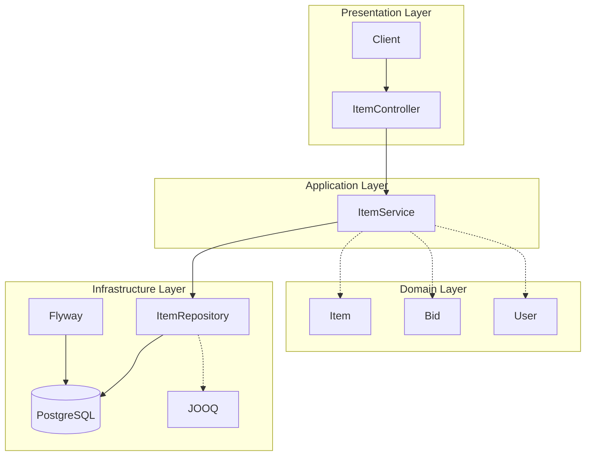

# System Patterns

**Created:** 2025-05-24  
**Status:** [ACTIVE]  
**Author:** Cascade AI Assistant  
**Last Modified:** 2025-05-24

## Table of Contents
- [Architectural Overview](#architectural-overview)
- [System Components](#system-components)
- [Data Flow](#data-flow)
- [Integration Patterns](#integration-patterns)
- [Design Decisions](#design-decisions)
- [Cross-Cutting Concerns](#cross-cutting-concerns)
- [Scalability Considerations](#scalability-considerations)

## Architectural Overview
The system follows a clean architecture approach with clear separation of concerns between layers:
- **Presentation Layer**: Handles HTTP requests/responses, input validation, and API documentation
- **Application Layer**: Contains use cases and business logic
- **Domain Layer**: Core business entities and rules
- **Infrastructure Layer**: Database access, external services, and framework-specific code

### Architecture Diagram

## System Components
### ItemController
- **Purpose:** Handle HTTP requests and responses for auction item operations
- **Responsibilities:**
  - Validate input DTOs
  - Map between DTOs and domain models
  - Handle HTTP status codes and error responses
  - Enforce API contracts
  - Pagination and sorting support
- **Dependencies:** ItemService, DTOs, OpenAPI annotations

### ItemService
- **Purpose:** Implement business logic for auction item operations
- **Responsibilities:**
  - Enforce auction business rules
  - Coordinate between domain objects and repositories
  - Handle transactions
  - Apply business validations
  - Manage item lifecycle
- **Dependencies:** ItemRepository, Domain Models, Event Publisher

### ItemRepository
- **Purpose:** Abstract database operations for items and bids
- **Responsibilities:**
  - CRUD operations for Item and Bid entities
  - Complex query execution with JOOQ
  - Data access optimizations
  - Pagination support
- **Dependencies:** JOOQ, Database, Flyway

### Domain Models
- **Purpose:** Represent core business entities and rules
- **Key Entities:**
  - `Item`: Represents an auction item with properties like title, description, status, timestamps
  - `Bid`: Represents a bid placed on an item with amount, bidder, and timestamp
  - `User`: System user who can list items and place bids
- **Value Objects:**
  - `Money`: Represents monetary values with currency
  - `TimeRange`: Represents auction start/end times
  - `ItemStatus`: Enum for item states (DRAFT, ACTIVE, SOLD, EXPIRED, CANCELLED)
- **Responsibilities:**
  - Encapsulate business rules
  - Ensure data integrity
  - Provide domain-specific behavior
  - Enforce invariants

## Data Flow
### Item Listing Flow
1. **Request Handling**
   - Client sends GET request to `/api/v1/items` with pagination parameters
   - Spring MVC routes request to `ItemController.listItems()`

2. **Input Validation**
   - Spring Validation validates query parameters
   - Custom validators check date ranges and status filters

3. **Business Logic**
   - `ItemService.listItems()` is called with validated parameters
   - Service applies business rules for filtering and sorting
   - Pagination is handled at the service layer

### Bid Placement Flow
1. **Request Handling**
   - Client sends POST request to `/api/v1/items/{id}/bids` with bid details
   - Spring MVC routes request to `ItemController.placeBid()`

2. **Input Validation**
   - Request body is validated against BidRequest DTO
   - Custom validators check bid amount and auction status

3. **Business Logic**
   - `ItemService.placeBid()` is called with validated data
   - Service enforces bidding rules (e.g., minimum bid increment)
   - Transaction ensures data consistency
   - Event is published for bid placement
   - If valid, creates new User domain object
   - Saves user to database via `UserRepository`

4. **Response Generation**
   - Created user is mapped to response DTO
   - 201 Created response with Location header is returned

5. **Error Handling**
   - Validation errors return 400 Bad Request
   - Duplicate phone numbers return 409 Conflict
   - Server errors return 500 Internal Server Error

## Integration Patterns
### Database Access
- **Pattern:** Repository Pattern with JOOQ
- **Implementation:**
  - Type-safe SQL queries with Kotlin DSL
  - Generated DAOs and POJOs
  - Custom type bindings for Kotlin types
  - Transaction management via Spring `@Transactional`
  - Batch operations support
  - Optimistic locking for concurrent updates

### API Design
- **Style:** RESTful with HATEOAS (planned)
- **Versioning:** URI versioning (`/api/v1/...`)
- **Documentation:** OpenAPI 3.0 with Swagger UI
- **Error Handling:**
  - Global exception handler
  - Consistent error response format
  - Proper HTTP status codes
  - Error codes for client handling
- **Validation:**
  - Bean Validation (JSR-380)
  - Custom validators
  - Input sanitization
  - Business rule validation

### Event-Driven Architecture
- **Pattern:** Publish-Subscribe
- **Implementation:** Spring Events
- **Use Cases:**
  - Bid placed notifications
  - Auction ending soon alerts
  - Outbid notifications
  - Item status updates

## Design Decisions
### ARCH-001 - Clean Architecture with DDD
**Date:** 2025-05-24  
**Status:** Approved  
**Context:** Need to maintain separation of concerns and business logic encapsulation  
**Decision:** Adopt Clean Architecture with Domain-Driven Design principles  
**Rationale:**  
- Clear separation between domain logic and infrastructure  
- Improved testability of business rules  
- Flexibility to change frameworks without affecting domain  
- Better alignment with business requirements  
**Consequences:**  
- Additional mapping between layers  
- Requires discipline to maintain boundaries  
**Alternatives Considered:** Traditional layered architecture, Hexagonal Architecture

### ARCH-002 - JOOQ for Database Access
**Date:** 2025-05-24  
**Status:** Approved  
**Context:** Need for type-safe SQL queries with Kotlin in a domain-driven context  
**Decision:** Use JOOQ with Kotlin DSL and custom repository pattern  
**Rationale:**  
- Compile-time SQL validation  
- Kotlin DSL for type-safe queries  
- Fine-grained control over SQL  
- Good performance for complex auction queries  
**Consequences:**  
- Need to manage generated code  
- Learning curve for JOOQ  
**Alternatives Considered:**  
- Spring Data JPA (less control over queries)  
- Exposed (less mature)  
- jOOQ with JPA (increased complexity)

### ARCH-003 - Event-Driven Architecture
**Date:** 2025-05-24  
**Status:** Approved  
**Context:** Need for loose coupling between auction components  
**Decision:** Implement event-driven patterns for auction lifecycle events  
**Rationale:**  
- Decouples auction logic from notification systems  
- Enables future extensibility  
- Better scalability for high-bid-volume scenarios  
**Consequences:**  
- Additional complexity in event handling  
- Need for idempotent event processing  
**Alternatives Considered:**  
- Direct method calls (tighter coupling)  
- Message queues (overkill for current scale)

### API-003 - RESTful API Design
**Date:** 2025-05-24  
**Status:** Approved  
**Context:** Need a clean, standards-based API design  
**Decision:** Follow RESTful principles with proper HTTP methods and status codes  
**Consequences:**
  - Predictable API behavior
  - Good client compatibility
  - More verbose than RPC-style APIs
**Alternatives Considered:** GraphQL, gRPC

## Cross-Cutting Concerns
### Error Handling
- **Global Exception Handler:** Centralized error handling with `@ControllerAdvice`
- **Error Responses:** Standardized error format with error codes and messages
- **Validation Errors:** Detailed field-level validation errors
- **Logging:** Structured logging with appropriate log levels

### Transaction Management
- **Approach:** Declarative transactions with `@Transactional`
- **Propagation:** `REQUIRED` (default) for most operations
- **Read-Only:** Optimized for read operations where possible
- **Rollback:** Automatic rollback on runtime exceptions

### Logging & Monitoring
- **Structured Logging:** JSON format for log aggregation
- **Correlation IDs:** Track requests across service boundaries
- **Metrics:** Basic metrics for API endpoints
- **Health Checks:** `/actuator/health` endpoint for monitoring

## Scalability Considerations
### Horizontal Scaling
- **Stateless Design:** All state is stored in the database
- **Connection Pooling:** HikariCP for efficient database connections
- **Stateless Authentication:** JWT-based authentication (future)
- **Containerization:** Ready for container orchestration

### Performance Optimization
- **Database Indexes:** Proper indexing on frequently queried fields
- **Query Optimization:** JOOQ for efficient SQL generation
- **Connection Pooling:** Optimized connection pool settings
- **Caching Strategy:** (Future) Redis for frequently accessed data

### Future Considerations
- **Read Replicas:** For read-heavy workloads
- **Sharding:** If user base grows significantly
- **CQRS:** Separate read/write models if needed
