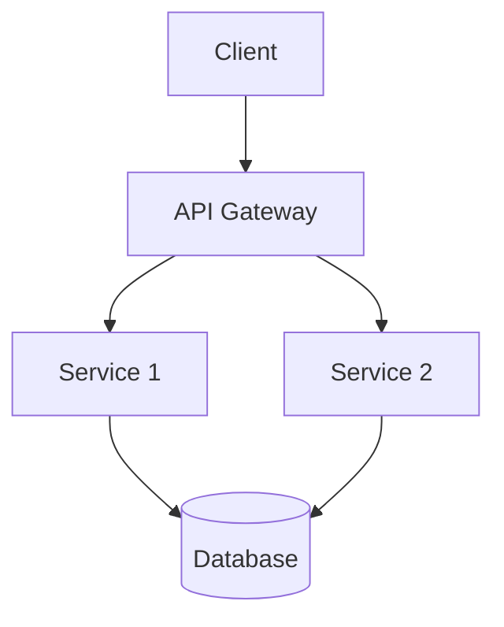

# System Patterns

**Created:** 2025-05-24  
**Status:** [DRAFT]  
**Author:** [Your Name]  
**Last Modified:** 2025-05-24

## Table of Contents
- [Architectural Overview](#architectural-overview)
- [System Components](#system-components)
- [Data Flow](#data-flow)
- [Integration Patterns](#integration-patterns)
- [Design Decisions](#design-decisions)
- [Cross-Cutting Concerns](#cross-cutting-concerns)
- [Scalability Considerations](#scalability-considerations)

## Architectural Overview
[High-level description of the system architecture]

### Architecture Diagram

## System Components
### [Component 1]
- **Purpose:** [Brief description]
- **Responsibilities:**
  - [Responsibility 1]
  - [Responsibility 2]
- **Dependencies:** [Other components/services]

### [Component 2]
- **Purpose:** [Brief description]
- **Responsibilities:**
  - [Responsibility 1]
  - [Responsibility 2]
- **Dependencies:** [Other components/services]

## Data Flow
### [Flow Name]
1. [Step 1]
2. [Step 2]
3. [Step 3]

## Integration Patterns
### [Pattern Name]
- **When to use:** [Scenario]
- **Implementation:** [Description]
- **Example:** [Example usage]

## Design Decisions
### [Decision ID] - [Short Description]
**Date:** YYYY-MM-DD  
**Status:** [Proposed/Approved/Deprecated]  
**Context:** [Problem statement]  
**Decision:** [Chosen solution]  
**Consequences:** [Impact and trade-offs]  
**Alternatives Considered:** [Other options considered]

## Cross-Cutting Concerns
### Authentication & Authorization
- [Approach and patterns used]

### Error Handling
- [Error handling strategy]
- [Logging and monitoring approach]

### Data Consistency
- [Consistency model]
- [Transaction management]

## Scalability Considerations
### Horizontal Scaling
- [Approach to horizontal scaling]

### Performance Optimization
- [Performance optimization techniques]
- [Caching strategy]
