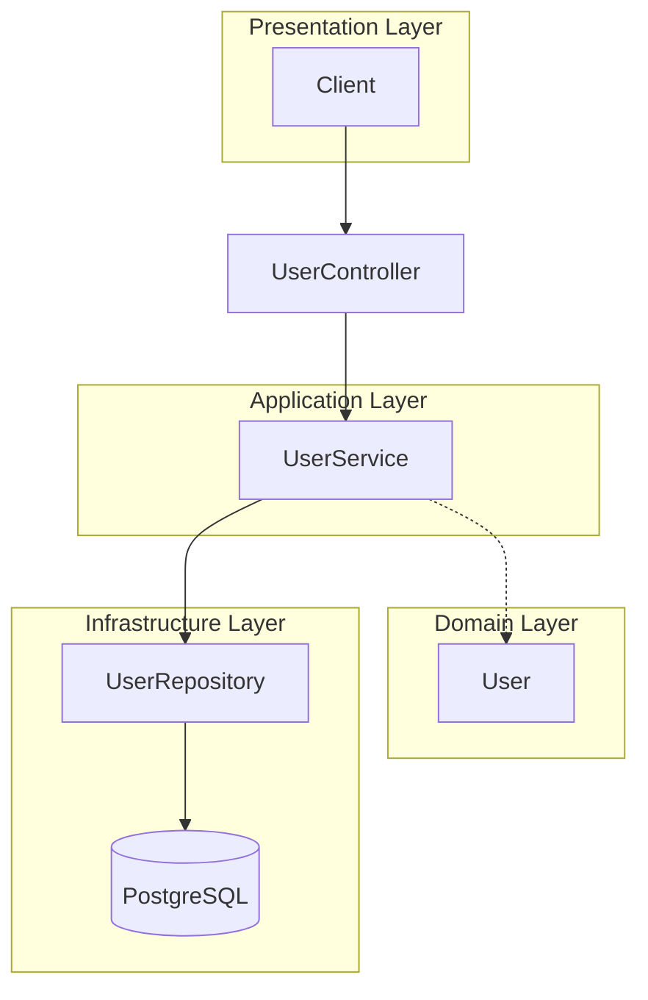

# System Patterns

**Created:** 2025-05-24  
**Status:** [ACTIVE]  
**Author:** Cascade AI Assistant  
**Last Modified:** 2025-05-24

## Table of Contents
- [Architectural Overview](#architectural-overview)
- [System Components](#system-components)
- [Data Flow](#data-flow)
- [Integration Patterns](#integration-patterns)
- [Design Decisions](#design-decisions)
- [Cross-Cutting Concerns](#cross-cutting-concerns)
- [Scalability Considerations](#scalability-considerations)

## Architectural Overview
The system follows a clean architecture approach with clear separation of concerns between layers:
- **Presentation Layer**: Handles HTTP requests/responses, input validation, and API documentation
- **Application Layer**: Contains use cases and business logic
- **Domain Layer**: Core business entities and rules
- **Infrastructure Layer**: Database access, external services, and framework-specific code

### Architecture Diagram


## System Components
### UserController
- **Purpose:** Handle HTTP requests and responses for user-related operations
- **Responsibilities:**
  - Validate input DTOs
  - Map between DTOs and domain models
  - Handle HTTP status codes and error responses
  - Enforce API contracts
- **Dependencies:** UserService, DTOs

### UserService
- **Purpose:** Implement business logic for user operations
- **Responsibilities:**
  - Enforce business rules
  - Coordinate between domain objects and repositories
  - Handle transactions
  - Apply business validations
- **Dependencies:** UserRepository, Domain Models

### UserRepository
- **Purpose:** Abstract database operations
- **Responsibilities:**
  - CRUD operations for User entity
  - Query execution
  - Data access optimizations
- **Dependencies:** JOOQ, Database

### Domain Models
- **Purpose:** Represent core business entities and rules
- **Key Entities:**
  - User: Core user entity with validation rules
  - Value Objects: PhoneNumber, Email (planned)
- **Responsibilities:**
  - Encapsulate business rules
  - Ensure data integrity
  - Provide domain-specific behavior

## Data Flow
### User Registration Flow
1. **Request Handling**
   - Client sends POST request to `/api/v1/users/register` with user details
   - Spring MVC routes request to `UserController.registerUser()`

2. **Input Validation**
   - Spring Validation validates request DTO
   - Custom validators check phone number format and uniqueness

3. **Business Logic**
   - `UserService.registerUser()` is called with validated data
   - Service checks for duplicate phone numbers
   - If valid, creates new User domain object
   - Saves user to database via `UserRepository`

4. **Response Generation**
   - Created user is mapped to response DTO
   - 201 Created response with Location header is returned

5. **Error Handling**
   - Validation errors return 400 Bad Request
   - Duplicate phone numbers return 409 Conflict
   - Server errors return 500 Internal Server Error

## Integration Patterns
### Repository Pattern
- **When to use:** Abstracting data access from business logic
- **Implementation:**
  - `UserRepository` interface defines data access contracts
  - `JooqUserRepository` provides JOOQ implementation
  - Domain models are independent of persistence details
- **Example:**
  ```kotlin
  interface UserRepository {
      fun save(user: User): User
      fun findByPhoneNumber(phoneNumber: String): User?
      fun existsByPhoneNumber(phoneNumber: String): Boolean
  }
  ```

### DTO Pattern
- **When to use:** Decoupling API contracts from domain models
- **Implementation:**
  - Separate classes for API requests/responses
  - Mappers convert between DTOs and domain models
  - Prevents over-posting and information leakage
- **Example:**
  ```kotlin
  // Request DTO
  data class UserRegistrationRequest(
      val phoneNumber: String,
      val name: String,
      val email: String? = null
  )
  
  // Response DTO
  data class UserResponse(
      val id: Long,
      val phoneNumber: String,
      val name: String,
      val email: String?,
      val createdAt: Instant,
      val updatedAt: Instant
  )
  ```

## Design Decisions
### DDD-001 - Domain-Driven Design Approach
**Date:** 2025-05-24  
**Status:** Approved  
**Context:** Need to model complex business rules around user registration and management  
**Decision:** Adopt DDD principles with clear separation between domain, application, and infrastructure layers  
**Consequences:** 
  - Clear separation of concerns
  - Business logic is testable and framework-agnostic
  - More complex initial setup
**Alternatives Considered:** Anemic domain model with service layer

### ARCH-002 - JOOQ for Database Access
**Date:** 2025-05-24  
**Status:** Approved  
**Context:** Need type-safe SQL queries with good Kotlin support  
**Decision:** Use JOOQ as the primary database access layer  
**Consequences:**
  - Type-safe SQL queries
  - Good Kotlin integration
  - Additional build step for code generation
**Alternatives Considered:** Spring Data JPA, Exposed, raw JDBC

### API-003 - RESTful API Design
**Date:** 2025-05-24  
**Status:** Approved  
**Context:** Need a clean, standards-based API design  
**Decision:** Follow RESTful principles with proper HTTP methods and status codes  
**Consequences:**
  - Predictable API behavior
  - Good client compatibility
  - More verbose than RPC-style APIs
**Alternatives Considered:** GraphQL, gRPC

## Cross-Cutting Concerns
### Error Handling
- **Global Exception Handler:** Centralized error handling with `@ControllerAdvice`
- **Error Responses:** Standardized error format with error codes and messages
- **Validation Errors:** Detailed field-level validation errors
- **Logging:** Structured logging with appropriate log levels

### Transaction Management
- **Approach:** Declarative transactions with `@Transactional`
- **Propagation:** `REQUIRED` (default) for most operations
- **Read-Only:** Optimized for read operations where possible
- **Rollback:** Automatic rollback on runtime exceptions

### Logging & Monitoring
- **Structured Logging:** JSON format for log aggregation
- **Correlation IDs:** Track requests across service boundaries
- **Metrics:** Basic metrics for API endpoints
- **Health Checks:** `/actuator/health` endpoint for monitoring

## Scalability Considerations
### Horizontal Scaling
- **Stateless Design:** All state is stored in the database
- **Connection Pooling:** HikariCP for efficient database connections
- **Stateless Authentication:** JWT-based authentication (future)
- **Containerization:** Ready for container orchestration

### Performance Optimization
- **Database Indexes:** Proper indexing on frequently queried fields
- **Query Optimization:** JOOQ for efficient SQL generation
- **Connection Pooling:** Optimized connection pool settings
- **Caching Strategy:** (Future) Redis for frequently accessed data

### Future Considerations
- **Read Replicas:** For read-heavy workloads
- **Sharding:** If user base grows significantly
- **CQRS:** Separate read/write models if needed
